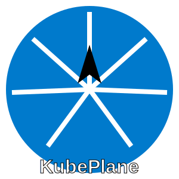

# KubePlane (KP)

KubePlane is a Continuous Software Delivery Platform, that aims to deal with day 0 challenges and ease the day 1 - N concerns.

## Goals

- Efficiency: Binpacking, Scale to Zero, Spot instances, eBPF
- Safety: Anamoly detection, Policy enforcement, Image scanning, Audit trail
- Observability: Metrics, Logs, Tracing
- Scalability: Multi-tenancy, Multi-cloud, Enterprise-grade
- Complexity: No-Fork, No-Operator
- Reliability: Alerting, Rollback, Backup+Restore, Semantic Versioning
- DevEx: GitOps, CI/CD, Self-Service, Cloud-Agnostic

## Non-Goals

- Re-inventing the wheel
  - e.g. Rebuilding any UI from scratch when existing tools already provide them.

## Contact

Email us at [kubeplane+gh@audacioustux.com](mailto:kubeplane+gh@audacioustux.com)
